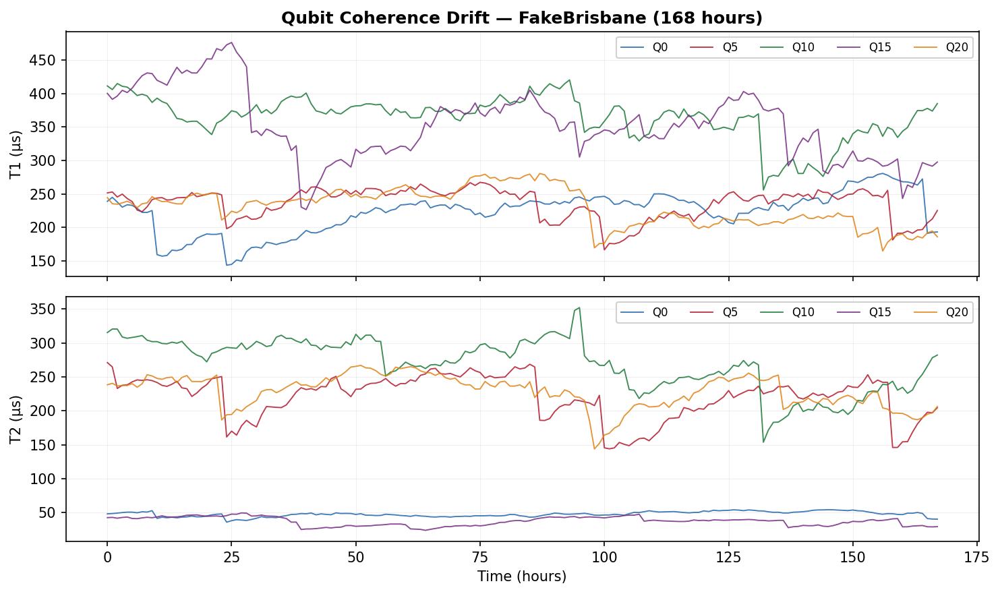
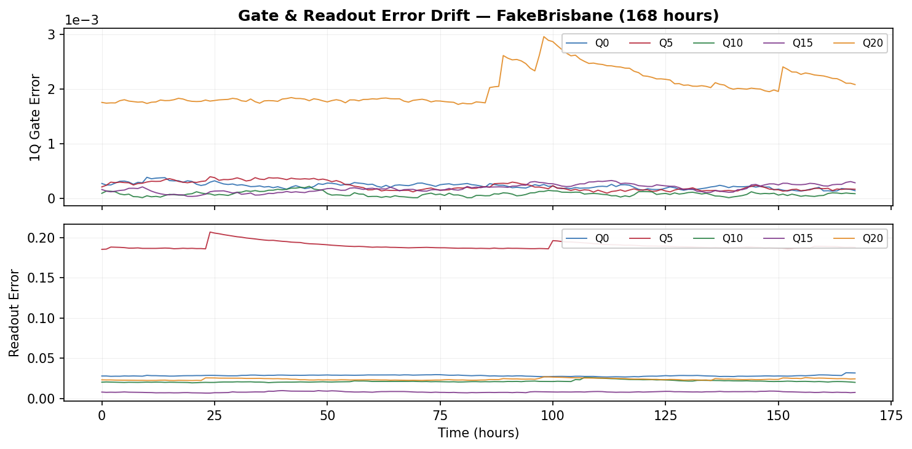
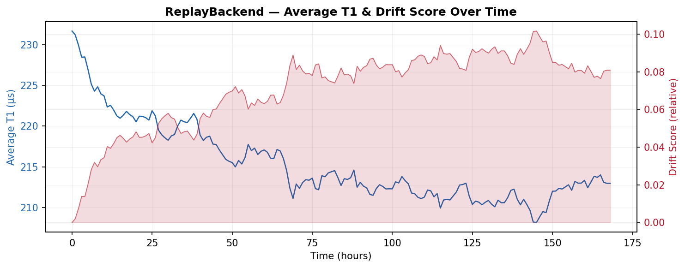

# Day 2 — ReplayBackend + CalibrationData + 漂移模型

**日期**: 2026-05-15  
**Commit**: `19692a5`  
**完成标志**: FakeBrisbane.run(transpile(GHZ_5)) 输出 fidelity + ReplayBackend 单测通过

---

## 交付件

### 1. CalibrationSnapshot 数据模型 (`calibration_data.py`)

从 FakeBrisbane 等 V2 后端提取完整校准数据：
- 127 qubit 的 T1, T2, readout error, 1Q gate error
- 184 条 coupling edge 的 2Q gate error
- 支持 FakeBrisbane / FakeKyiv / FakeSherbrooke / FakeTorino

### 2. 漂移生成器 (`generate_drift_series`)

物理真实的漂移模型：
- **Ornstein-Uhlenbeck 过程**: 均值回复随机游走（模拟热波动）
- **Poisson 突变跳跃**: T1 骤降时 T2 和 gate error 关联恶化（模拟 TLS 事件）
- **物理约束**: T2 ≤ 2×T1, T1 ∈ [5, 500] μs, readout ∈ [0.001, 0.5]

### 3. ReplayBackend (`replay.py`)

按时间回放校准快照序列：
- `speed` 参数控制回放速率（60.0 = 1 小时数据 / 1 分钟真实时间）
- `seek(index)` 跳转到任意快照
- 自动缓存 AerSimulator（同一快照不重建 noise model）
- 完整 ShadowBackend 接口实现

### 4. FakeBackendAdapter (`fake_adapter.py`)

Qiskit FakeBackendV2 的 ShadowBackend 包装：
- 自动提取 noise model → AerSimulator
- 计算 fidelity vs ideal（≤20 qubit）
- 支持 get_health / get_qubit_properties / get_coupling_map

---

## 可视化

### T1/T2 漂移时间线 (168 小时)

5 个代表性 qubit (Q0, Q5, Q10, Q15, Q20) 的 T1 和 T2 随时间变化。
可见渐变漂移叠加突变跳跃的特征。

### Gate Error / Readout Error 漂移

同一组 qubit 的 1Q gate error 和 readout error 变化。
Gate error 量级 ~10⁻⁴，跳跃式恶化可见。

### ReplayBackend 健康指标

ReplayBackend 按小时扫描：蓝线 = 平均 T1，红色填充 = 漂移评分。
展示了 agent 通过 get_health() 能感知到的信息。

---

## 设计要点

- 漂移模型基于 IBM Quantum 真实观测规律（Klimov et al., PRL 2018）
- OU 过程的 θ=0.05 保证均值回复不会跑飞
- TLS 跳跃概率 3%/step，关联性：T1 跌 → T2 跟跌 × (0.8~1.2) → gate error 升
