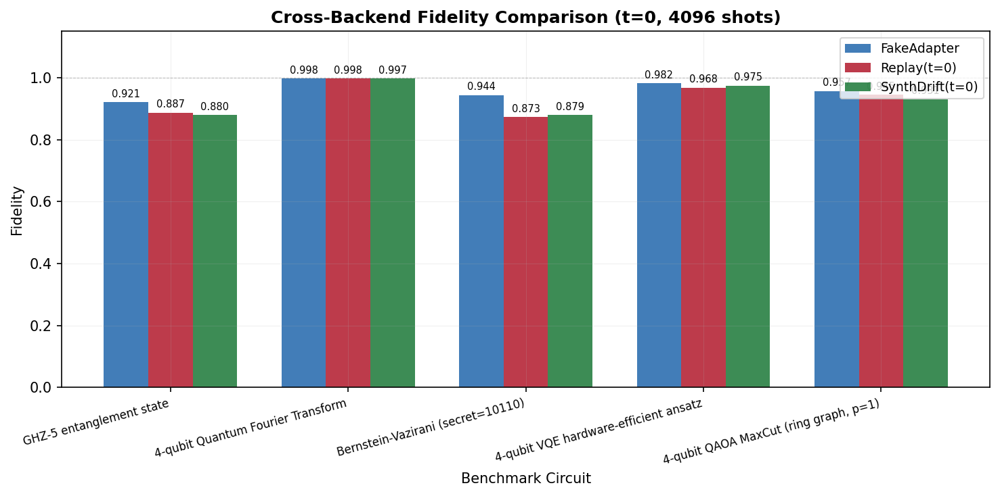
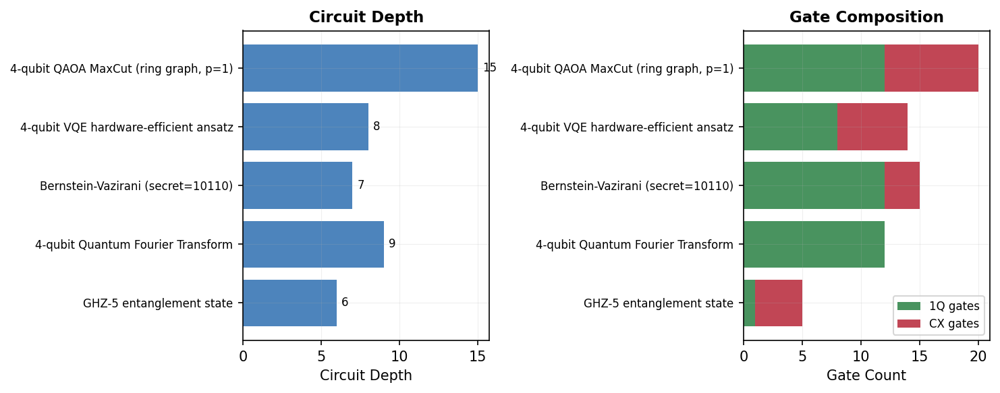

# Day 3 — Benchmark 电路 + 交叉验证 + PropertiesStream

**日期**: 2026-05-15  
**Commit**: `6ad6886`  
**完成标志**: 5 个电路在 3 个后端上出 fidelity

---

## 交付件

### 1. 五种基准电路 (`bench/circuits.py`)

| 电路 | Qubits | 用途 | 特点 |
|------|--------|------|------|
| GHZ-5 | 5 | 纠缠基准 | 浅深度，对 CX 噪声敏感 |
| QFT-4 | 4 | 量子傅里叶变换 | 中等深度，大量受控旋转 |
| BV-5 | 5+1 | Bernstein-Vazirani | 结构化 oracle |
| VQE-4 | 4 | 变分本征求解器 | 参数化，硬件高效 ansatz |
| QAOA-4 | 4 | 最大割优化 | 组合优化，ring graph |

### 2. 交叉验证结果

5 电路 × 3 后端，shots=4096，t=0（初始校准状态）：

| Circuit | FakeAdapter | Replay(t=0) | SynthDrift(t=0) |
|---------|-------------|-------------|-----------------|
| GHZ-5 | 0.921 | 0.887 | 0.880 |
| QFT-4 | 0.998 | 0.998 | 0.997 |
| BV-5 | 0.944 | 0.873 | 0.879 |
| VQE-4 | 0.983 | 0.968 | 0.975 |
| QAOA-4 | 0.957 | 0.945 | 0.931 |

**观察**:
- QFT-4 在所有后端上 fidelity 都很高（~0.998），因为 QFT|0⟩ = 均匀分布
- GHZ 和 BV 对噪声最敏感（多 CX 门）
- FakeAdapter 使用完整 127q 噪声模型，depth 较高（transpile 到全连接图）
- Replay/SynthDrift 使用 20q 子集，depth 较低但噪声密度更高

### 3. PropertiesStream — 实时遥测模拟

后台线程按固定间隔发射校准快照：
- Observer 模式：注册 callback 接收快照
- 历史缓冲：可查询最近 N 条
- `emit_once()` 手动触发（测试用）

### 4. Related Work Survey (`docs/related_work_survey.md`)

7 篇竞品论文调研：

| 论文 | 核心能力 | 缺什么 |
|------|----------|--------|
| QUASAR | 门级电路生成 (RL) | 无设备感知 |
| El Agente Quntur | 量子计算教学 Agent | 无真实执行 |
| Agent-Q | Web 导航 Agent | 非量子领域 |
| QAgent | 电路合成 Agent | 无漂移/闭环 |
| AlphaQubit | 解码纠错码 | 单任务，无 agent |
| QCoder | LLM 生成量子代码 | 无执行反馈 |
| GenQC | 扩散模型生成电路 | 无设备交互 |

**QuantumGPT 差异化**: 唯一做到 "设备感知 + 闭环执行 + 漂移自适应" 的 agent。

---

## 可视化

### Fidelity 交叉对比

三种后端在 5 种基准电路上的 fidelity 柱状对比。

### 电路结构

5 种基准电路的深度和门组成（1Q vs CX）。
