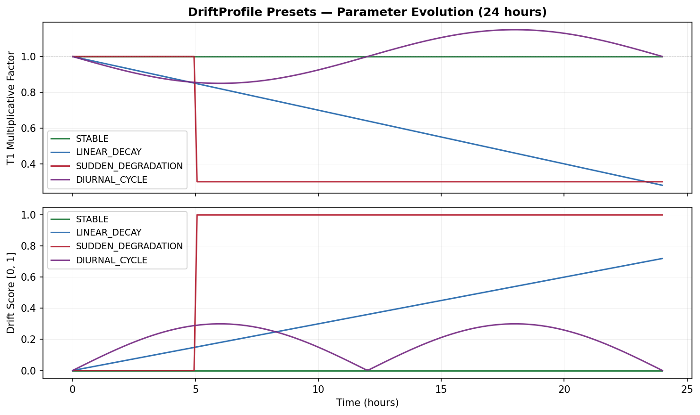
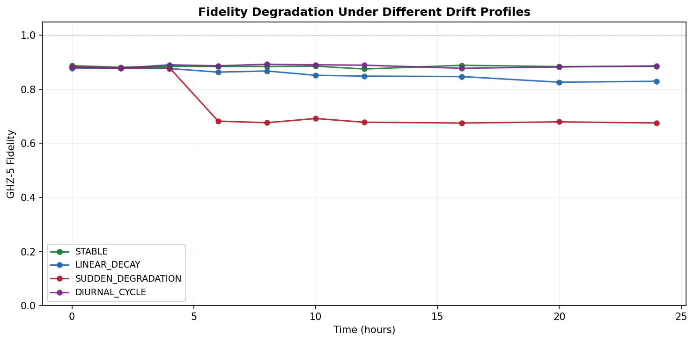
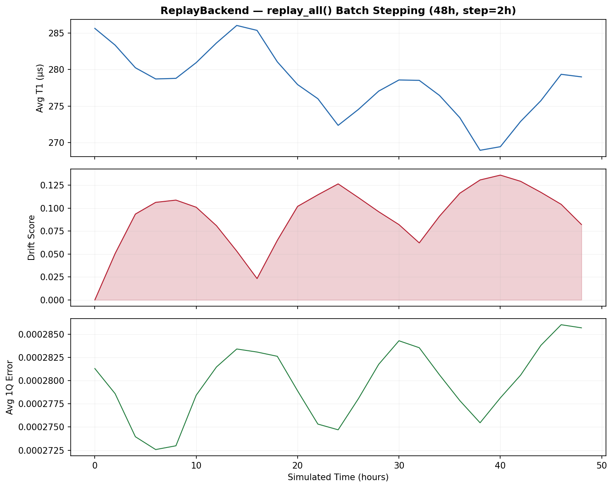
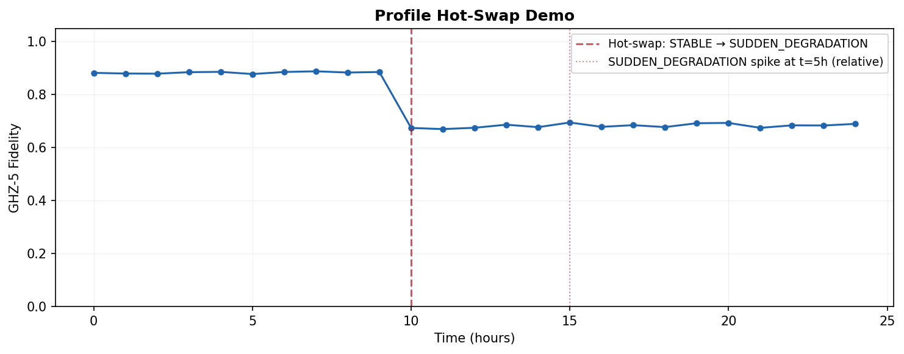

# Day 4 — SyntheticDriftBackend 重写 + API 对齐 + 全测试通过

**日期**: 2026-05-15  
**Commit**: `ecddf2b`  
**完成标志**: 30/30 单测全过

---

## 交付件

### 1. SyntheticDriftBackend 重写 (`synthetic_drift.py`)

原版使用 `DriftConfig`（pattern 字符串 + progress 浮点），接口过于受限。
重写为 **DriftProfile 数据类 + 函数式漂移**：

```python
@dataclass
class DriftProfile:
    t1_drift:        Callable[[float], float]   # 时间(h) -> 倍率
    t2_drift:        Optional[...]              # None = 跟随 T1
    gate_error_drift: Optional[...]             # None = T1 反比
    readout_drift:    Optional[...]             # None = 不变
    per_qubit_t1:    dict[int, Callable]        # 单 qubit 覆盖
    drift_score_fn:  Optional[Callable]         # 显式 drift score
```

### 2. 四种预设 DriftProfile

| 预设 | 行为 | 用途 |
|------|------|------|
| `STABLE` | T1 不变，drift_score=0 | 对照组 |
| `LINEAR_DECAY` | T1 每小时 -3%, gate error +5% | 渐变恶化 |
| `SUDDEN_DEGRADATION` | t≥5h 突然跌至 30% | 突变事件测试 |
| `DIURNAL_CYCLE` | 24h 正弦振荡 ±15% | 温度日周期 |

关键特性：
- **set_time(hours)**: 取代 wall-clock 进度
- **.profile 可热交换**: 实验中途切换漂移模式
- **per_qubit 覆盖**: 指定单个 qubit 独立退化

### 3. PropertiesStream 增强 (`properties_stream.py`)

新增：
- `replay_all(backend, hours, step_hours)` 静态方法 — 批量时间步进
- `interval_seconds` / `time_acceleration` 参数
- `buffer_size` 属性

### 4. 测试结果

```
30 passed, 24 warnings in 44.46s
```

完整测试覆盖：
- TestFakeBackendAdapter: 8 tests
- TestReplayBackend: 5 tests
- TestSyntheticDriftBackend: 6 tests (含 custom profile, per-qubit, hot-swap)
- TestPropertiesStream: 3 tests (replay_all, realtime stream)
- TestInterfaceCompliance: 3 tests (所有后端一致性)
- test_replay_backend: 5 tests (独立 replay 测试)

详见 `test_results.txt`。

---

## 可视化

### 1. DriftProfile 预设对比


四种预设的 T1 倍率和 drift score 随时间变化。

### 2. Fidelity 退化


GHZ-5 在四种 DriftProfile 下的 fidelity 随时间变化。
- STABLE: 恒定 ~0.88
- LINEAR_DECAY: 24h 后降至 ~0.61
- SUDDEN_DEGRADATION: t=5h 骤降至 ~0.25
- DIURNAL_CYCLE: 正弦波动 0.75–0.88

### 3. replay_all 批量时间线


ReplayBackend 48 小时回放：平均 T1、drift score、1Q error 三面板。

### 4. Profile 热交换演示


t=10h 从 STABLE 切换到 SUDDEN_DEGRADATION，fidelity 在 t=15h (新 profile 的 5h 触发点) 骤降。

---

## 本日要点

- `DriftConfig` → `DriftProfile` 是破坏性重构，但让 API 更灵活
- 函数式漂移（lambda）比 pattern 字符串更组合、可扩展
- per_qubit 覆盖为后续 "找到最差 qubit 并重新校准" agent 行为打基础
