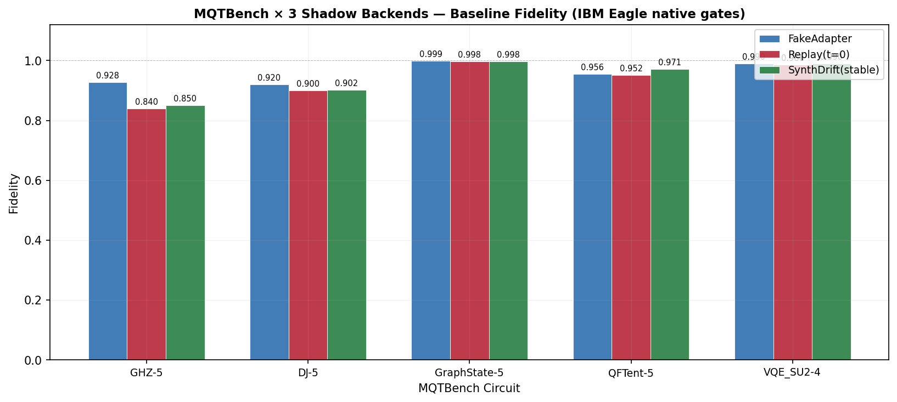
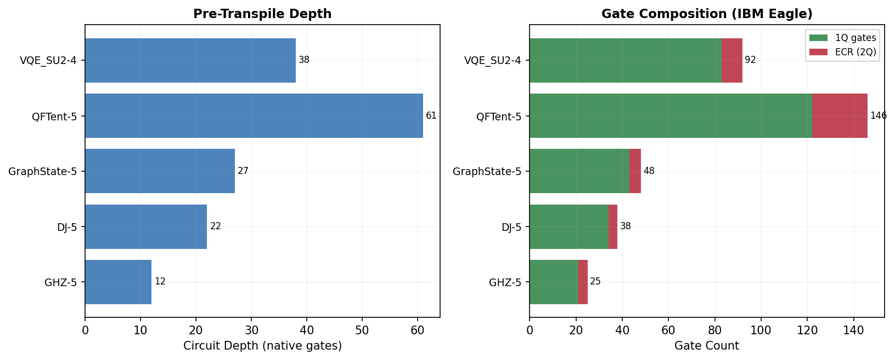
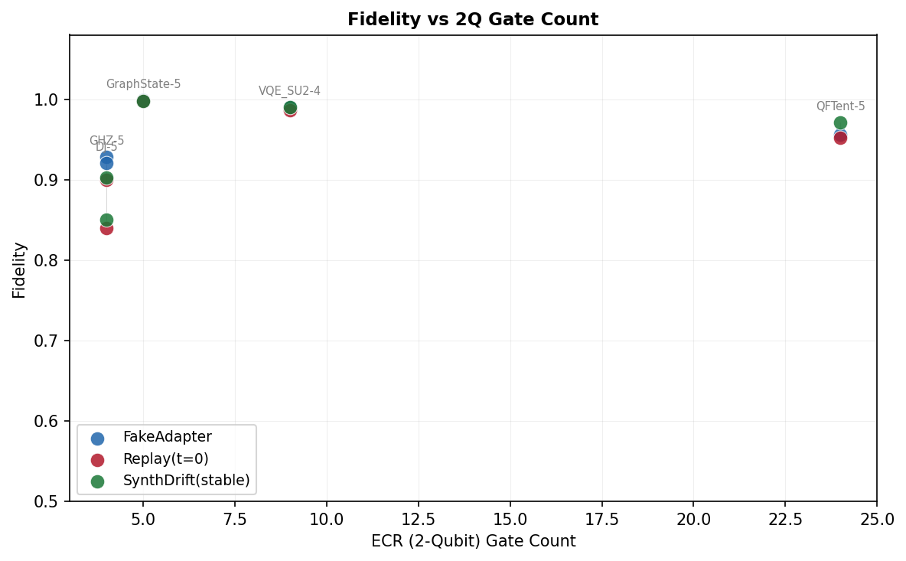
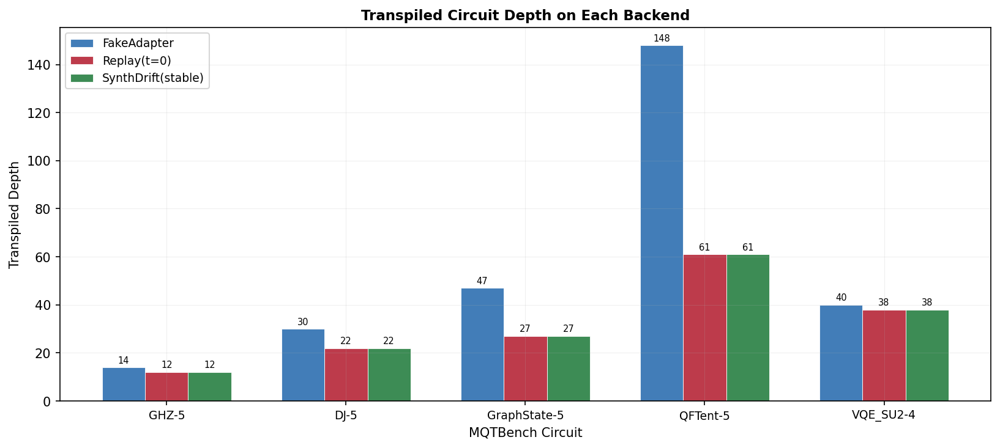
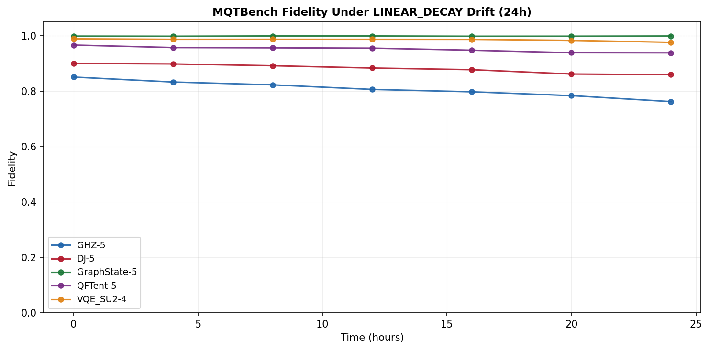

# Day 5 — MQTBench 集成 + 5 门级任务 Baseline

**日期**: 2026-05-15  
**完成标志**: 5 个 MQTBench 电路在 3 个后端上出 fidelity，37/37 测试通过

---

## 交付件

### 1. MQTBench 集成模块 (`bench/mqtbench.py`)

封装 MQT Bench v2.2.2，提供：
- `get_mqtbench_circuits()`: 生成 NATIVEGATES 级别电路（IBM Eagle 门集）
- `list_mqtbench_available()`: 列出全部 34 种可用 benchmark
- `MQTBenchCircuit` 数据类：电路 + 元数据

IBM Eagle 门集: **ECR** (2Q), **RZ**, **SX**, **X** (1Q)

### 2. 五种 MQTBench 电路

| 电路 | Qubits | Depth | ECR | Total Gates | 类型 |
|------|--------|-------|-----|-------------|------|
| GHZ-5 | 5 | 12 | 4 | 25 | 纠缠基准 |
| DJ-5 | 5 | 22 | 4 | 38 | Deutsch-Jozsa oracle |
| GraphState-5 | 5 | 27 | 5 | 48 | 图态制备 |
| QFTent-5 | 5 | 61 | 24 | 146 | QFT + 纠缠 |
| VQE_SU2-4 | 4 | 38 | 9 | 92 | 变分 SU(2) ansatz |

选择逻辑：覆盖 纠缠/oracle/图态/傅里叶/变分 五大类，ECR 门数从 4 到 24 不等，复杂度梯度明显。

### 3. Baseline Fidelity 结果 (t=0, 8192 shots)

| Circuit | FakeAdapter | Replay(t=0) | SynthDrift(t=0) |
|---------|-------------|-------------|-----------------|
| GHZ-5 | 0.928 | 0.840 | 0.850 |
| DJ-5 | 0.920 | 0.900 | 0.902 |
| GraphState-5 | 0.999 | 0.998 | 0.998 |
| QFTent-5 | 0.956 | 0.952 | 0.971 |
| VQE_SU2-4 | 0.990 | 0.986 | 0.990 |

**观察**：
- GraphState 几乎不受噪声影响（fidelity ~0.999），因为测量基态占主导
- GHZ 最敏感（4 CX but 全相干叠加）
- QFTent-5 深度最大 (61/148 transpiled) 但仍保持 >0.95
- FakeAdapter 使用完整 127q topology，transpile 后 depth 更高但噪声分散

### 4. 测试覆盖

新增 7 个测试（`test_mqtbench.py`）：
- `test_list_available` — MQTBench ≥30 benchmarks
- `test_default_selection` — 默认选 5 个正确
- `test_circuit_properties` — 元数据一致性
- `test_native_gate_set` — 只含 ECR/RZ/SX/X/measure
- `test_ecr_count` — ECR 计数正确
- `test_custom_selection` — 自定义选择
- `test_runnable_on_aer` — AerSimulator 可执行

全部测试: **37/37 passed** (含之前 30 个)

---

## 可视化

### 1. MQTBench Fidelity 对比

5 电路 × 3 后端的 fidelity 柱状图。

### 2. 电路复杂度

左: 电路深度（native gates），右: 门组成（1Q vs ECR）。

### 3. Fidelity vs 2Q 门数

散点图展示 fidelity 与 ECR 门数的关系。GHZ 虽然 ECR 最少但 fidelity 最低（对相干性要求最高）。

### 4. Transpiled Depth 对比

FakeAdapter (127q) 的 transpiled depth 显著高于 Replay/SynthDrift (20q)。

### 5. LINEAR_DECAY 下的 Fidelity 退化

5 个 MQTBench 电路在 LINEAR_DECAY 漂移下 24h 的 fidelity 时间线。QFTent-5 (24 ECR) 退化最快。

---

## 与 Day 3 bench/circuits.py 的关系

| | bench/circuits.py | bench/mqtbench.py |
|--|---|---|
| 来源 | 手写 | MQT Bench 标准库 |
| 门集 | 高级门 (H, CX, RY...) | Native gates (ECR, RZ, SX, X) |
| 可复现性 | 固定实现 | 版本化 benchmark suite |
| 用途 | 快速 smoke test | 论文级 benchmark |

两者互补：circuits.py 用于开发测试，mqtbench.py 用于正式实验。
