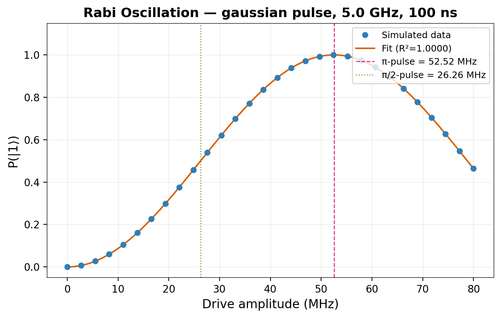

# Rabi Oscillation Experiment Report

## Experiment Parameters
- **Qubit frequency:** 5.0 GHz
- **Pulse shape:** gaussian
- **Pulse duration:** 100 ns
- **Amplitude sweep:** 0.00 – 80.00 MHz
- **Number of points:** 30

## Results
- **π-pulse amplitude:** 52.52 MHz (0.052522 GHz)
- **π/2-pulse amplitude:** 26.26 MHz (0.026261 GHz)
- **Fit R²:** 1.0000
- **Oscillation amplitude:** 1.0000
- **Offset:** 0.0000
- **π uncertainty:** 0.0 GHz

## Agent Trace
- **Model:** react-rule-planner-v1
- **Backend:** FakeBrisbane
- **Tool calls:** 5
- **Elapsed:** 11.3s

### Steps:
1. **Thought:** First, I need to check the backend health to understand current device state. Also getting detailed qubit properties.
   **Action:** `get_backend_health`
   **Action:** `get_qubit_properties`
1. **Thought:** Running a Rabi oscillation experiment for qubit characterization.
   **Action:** `rabi_experiment`
1. **Thought:** Fitting the Rabi data to extract π-pulse amplitude.
   **Action:** `fit_rabi`
1. **Thought:** Running ghz_5 circuit to measure fidelity.
   **Action:** `run_circuit`
   **Fidelity:** 0.9224
1. **Thought:** Fidelity target reached. Summarizing results.

## Figure
